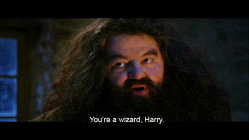
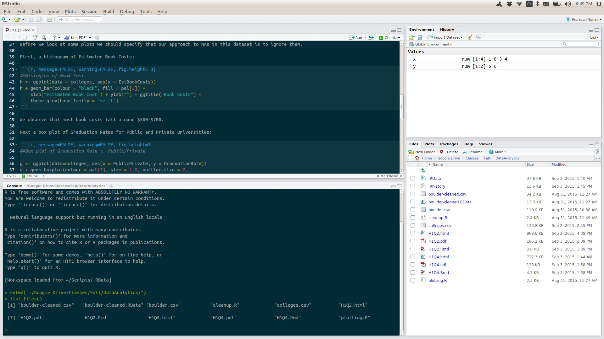
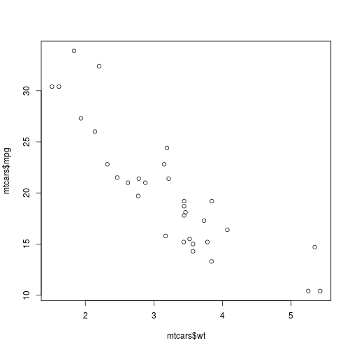
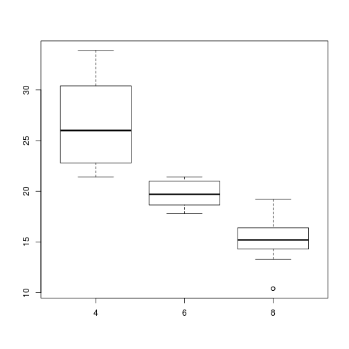

Getting Started with R
========================================================
author: Colin Pistell
date: Sept. 4, 2015
font-family: 'Ubuntu'


Big Picture: Types of languages
========================================================

- Two broad types: Declarative and Imperative
    - Declarative: Tell the computer what to do and it picks how to do it
    - Imperative: Tell the computer how to do what you want it to do.
    - SQL is Declarative. R (and Python, and C) is Imperative.
- Compiled vs. Interpreted
    - Lower level languages (C++, Java, etc.) must be compiled before they are run. The advantage is that, once compiled, they run VERY fast.
    - Higher level languages (Python, R, etc.) are Interpreted. No need to compile them beforehand, but they may run slower than their compiled cousins.

Object Oriented
========================================================

Most modern languages are Object Oriented. Basically this means that all data types are ‘objects’ and you specify how they interact with each other, which tends to simplify syntax. 


R in brief. Use to sound smart at cocktail parties
========================================================

- The reason R is “The coding language for data analysis” is it is highly optimized to perform matrix mathematics.
    - A lot of those functions are actually executed in C and FORTRAN code.
- Python is a more general-purpose coding language that can be adapted to do the same stuff, but R is better at it ‘out-of-the-box.’
- R has its weaknesses. Namely, its datasets must be stored in-memory, making it tricky to use for very large datasets. Also, out-of-the-box it only runs on a single CPU core. This can be changed, but it’s complicated.

R vs. RStudio
========================================================

- R is the coding language.

- RStudio is an IDE (Integrated Development Environment) Basically, IDEs offer a collection of nice features and an interface that makes coding easier, but often at the expense of speed
    - For our purposes, 99.9% of the time this won’t matter, so use RStudio – it makes our lives easier.
    - Just don’t fall into the trap of treating R/Rstudio like another piece of data analysis software (Excel, SPSS, etc.) It has WAY more power and flexibility… sometimes IDEs can lead us to think this way…

The Most Important Thing To Remember
====================================

<br>
<br>

***
<br>
<br>
- Coding is the closest thing we have to magic.
- You are now a wizard.
- Embrace it.

The Secret to Success
=====================

- Experiment endlessly.
    - You'll make mistakes, but each mistake will make you stronger.
- Practice, practice, practice
- Hackers (like you) don't give up. They get more creative.
    
Customizing Rstudio for MAXIMUM POWER!!!
=================================================

- Launch Rstudio. Then do the following: Tools -> Global Options
- Under the ‘Code’ section switch Tab Width to 4 (it will make your code easier to read)
- Under the ‘Appearance’ section, consider switching your editor theme to another setting. I and many others like Solarized Dark as a good daytime editing theme (there’s a bunch of [science](http://ethanschoonover.com/solarized) that went into it) but try a bunch to see what you prefer.

Getting to know your development environment
=============================================
left: 70%

<br>

***
<br>
- The top-left pane is your script/program.
- The bottom-left pane is your interactive console.

Getting to know your development environment
=============================================

- In the interactive console, when you write an R command and press enter it is executed immediately and the output is displayed
    - Great for messing around and experimenting, not so great for developing an actual script or program b/c it isn’t saved.
- In the script window, the commands you write are not executed until you tell R to do so, then it runs the whole thing
    - This is where you write (and save) actual programs.
    - Any output is displayed in the interactive console
    - It’s basically a text file. In fact, you can write R programs in any text editor! (Rstudio just makes it easier)

Getting to know your development environment
=============================================

- The ‘normal’ way to develop programs:
    - Think about what you want to do
    - Mess around in the interactive console until you figure out how to do it
    - Copy the code into the script file (Rstudio has some keyboard shortcuts to make this easy)
    - Rinse/Repeat until you’re done.

- Coding is a highly iterative process. Just remember: Each screw-up makes you stronger.

How to read the rest of these slides
====================================
class: small-code

- <small>The rest of these slides will be showing R input and output.</small>
- <small>Input will appear in a pale blue bar:</small>

```r
test <- "Here's some text"
```

- <small>Any output will appear beneath input with bracketed numbers keeping track of output indexing</small>


```r
print(test) #This shows one item of output
```

```
[1] "Here's some text"
```

```r
rnorm(20) #This shows multiple output items
```

```
 [1]  2.02188500 -1.82170871 -1.75436232  1.45830707 -0.46309822
 [6] -1.99507346 -1.91586099 -0.30003500  0.09098079 -0.96691016
[11]  1.16635781  1.93703403 -0.22642259 -0.65960784  1.43432604
[16]  0.93322151 -1.29360690  2.44242182 -1.57132949 -0.69510849
```

Brass Tacks: Expressions
==========================
class: small-code

You can use R as a glorified calculator. Try entering the following into your interactive console:


```r
2 + 3
```

```
[1] 5
```


```r
6 - 2
```

```
[1] 4
```


```r
2 * 3
```

```
[1] 6
```


```r
6 / 2
```

```
[1] 3
```

Brass Tacks: Assigning Variables
================================
class: small-code

- <small>Remember, R is object oriented meaning 90% of the time you will want to assign your output to a variable. Let's try:</small>


```r
x <- 3
y <- 2
x + y
```

```
[1] 5
```

- <small>The ‘<-’ characters (looks like an arrow, right?) just means that you want to assign an object (in this case the number 3) to a variable. So, now ‘x’ is set to be 3 and ‘y’ is set to be 2. When we add x and y together we get an output of 5. Mess around with some more variable assignments.</small>
- <small>What happens when you try to call a variable you haven't assigned yet?</small>

Object-Oriented-Interlude
==========================
class: small-code
- Here’s an experiment to get your head around what ‘object oriented’ means. This isn’t just for fun as if you don’t understand this it will trip you up at some point. Enter the following in order into your interactive console:


```r
x <- 3
y <- x
x
```

```
[1] 3
```

```r
y
```

```
[1] 3
```

Object-Oriented-Interlude
==========================
class: small-code

- So far so good. Both x and y will return 3 if typed into the console. Now…


```r
x <- 5
```

- Question: What does y now equal? Try it and see. Can you think of why this is true?


Object-Oriented-Interlude
===========================
class: small-code


```r
y
```

```
[1] 3
```

- So, y still equals 3. Why? When we originally assigned y to equal x, R looked at the object that x was pointing to – in this case 3. R then points the variable y to the same object. At this point we can point x to any other object and it won’t affect the object y is pointing to.

- This will mess you up at least once when a variable isn’t doing what you think it should.

Basic Classes
================
class: small-code

- Basic objects in R have *classes* which tells us something about what they are and how they behave.


```r
x <- 9
class(x)
```

```
[1] "numeric"
```

- The numeric class is numbers. They behave as you'd expect - you do math with them.


```r
y <- "tomato and basil"
class(y)
```

```
[1] "character"
```

- The character class (aka strings) are words. They are always encased in quotes.

Classes: Driving the point home
===============================
class: small-code

- <small>You can make a string out of numbers, like so:</small>

```r
n <- "1"
class(n)
```

```
[1] "character"
```

- <small>However, this is now no longer a numeric class object, so you can't do math with it...</small>


```r
"1"+1  #This won't work
```

- <small>But you can use it to include numbers in printed output text:</small>


```r
print("My favorite number is 7")
```

```
[1] "My favorite number is 7"
```

Classes: Binary/Logical/True-False
============================
class: small-code

- <small>Logical statements will return values of True or False</small>


```r
5 > 2; 2 > 5 #Semicolons allow you to separate multiple commands on one line
```

```
[1] TRUE
```

```
[1] FALSE
```

```r
2 == 2 #Use double equal signs for "equals" test
```

```
[1] TRUE
```

- <small>the class of these objects is 'logical'</small>

```r
x <- 5 > 2
class(x)
```

```
[1] "logical"
```

Vectors
============
class: small-code

- <small>Vectors are sequences of numbers</small>

```r
vec <- c(1, 1, 2, 3, 5)
```

- <small>...or strings</small>


```r
pets <- c("cat", "dog", "fish", "velociraptor")
```

- <small>You can select elements of vectors with the appropriate *index* number</small>


```r
vec[4]
```

```
[1] 3
```

```r
pets[2]
```

```
[1] "dog"
```

Coercion
=========
class: small-code

- <small>Elements of a vector must be of the same class. If they are not, some elements will be *coerced* or changed to match other elements.</small>

```r
mixed <- c(1, 2, "three", 4)
mixed
```

```
[1] "1"     "2"     "three" "4"    
```

```r
class(mixed)
```

```
[1] "character"
```

- <small>When you mix numbers and characters the vector will be coerced to characters.</small>

Forcing coercion
===============================
class: small-code

- <small>You can 'force' R to attempt coercion with the 'as.' functions:</small>


```r
numstring <- "2"
class(numstring)
```

```
[1] "character"
```

```r
numstring <- as.numeric(numstring)
numstring
```

```
[1] 2
```

```r
class(numstring)
```

```
[1] "numeric"
```

- <small>As you may expect, most classes have an associated 'as.' function.</small>

More on coercion
=================
class: small-code

- <small>If you try for an impossible coercion you'll end up with a value of 'NA'</small>

```r
as.numeric("bobcat")
```

```
[1] NA
```

- <small>Logical variables can be turned into numbers. True = 1, False = 0. This is very useful</small>


```r
nums <- c(1, 5, 2, 7)
tf <- nums > 3
tf
```

```
[1] FALSE  TRUE FALSE  TRUE
```

```r
sum(tf) #For logical variables R automatically does the coersion for you
```

```
[1] 2
```

Series
============
class: small-code

- <small>If you want to generate a long series of numbers you often don't need to write out every element. You can use ':'</small>


```r
1:20
```

```
 [1]  1  2  3  4  5  6  7  8  9 10 11 12 13 14 15 16 17 18 19 20
```

- <small>If you need more control, consider **seq()**</small>


```r
seq(0, 100, by = 20)
```

```
[1]   0  20  40  60  80 100
```

- <small>Note that series work for indexing as well:</small>


```r
pets[2:4]
```

```
[1] "dog"          "fish"         "velociraptor"
```

Working with vectors
======================
class: small-code

- **length()** will return the length of a vector:


```r
length(pets)
```

```
[1] 4
```

- You can combine vectors by using the standard **c()** function:


```r
bugs <- c("ant", "bee", "bombardier beetle")
c(pets, bugs)
```

```
[1] "cat"               "dog"               "fish"             
[4] "velociraptor"      "ant"               "bee"              
[7] "bombardier beetle"
```

- If you need more controls, consider **append()** or **paste()**

Vector Math
================
class: small-code

- For two numeric vectors of the same length operations will be performed across like-indexes:


```r
x <- c(1, 2, 3, 4)
y <- c(5, 6, 7, 8)
x + y
```

```
[1]  6  8 10 12
```

- For different lengths, if the lengths are divisible then the smaller vector loops:


```r
y <- c(5, 6)
x + y
```

```
[1]  6  8  8 10
```

Vector Math
==================
class: small-code

- If the vectors are different lengths but are not divisible, the smaller vector will loop but R will give you a warning message:


```r
x
```

```
[1] 1 2 3 4
```

```r
y <- c(5, 6 ,7)
x + y
```

```
[1]  6  8 10  9
```

Data Frames
=============
- So far we've been talking about vectors, which are one-dimensional series of values.
- Data Frames are a two dimensional heterogeneous object. Basically, think of them as an excel table.
- 'heterogeneous' is a fancy way of saying that they can contain a mixture of data types.
    - fyi, a 2-d table of homogeneous numeric data is a matrix.
- Data Frames are the object type we will probably work with the most, so let's get comfortable with them!

Example Data Frame: mtcars
============================
class: small-code

- R comes with a few practice data frames that we can play with. 'mtcars' is one of them.


```r
data(mtcars) #this loads the dataset into your environment
head(mtcars) #this lets up peek at the first few rows
```

```
                   mpg cyl disp  hp drat    wt  qsec vs am gear carb
Mazda RX4         21.0   6  160 110 3.90 2.620 16.46  0  1    4    4
Mazda RX4 Wag     21.0   6  160 110 3.90 2.875 17.02  0  1    4    4
Datsun 710        22.8   4  108  93 3.85 2.320 18.61  1  1    4    1
Hornet 4 Drive    21.4   6  258 110 3.08 3.215 19.44  1  0    3    1
Hornet Sportabout 18.7   8  360 175 3.15 3.440 17.02  0  0    3    2
Valiant           18.1   6  225 105 2.76 3.460 20.22  1  0    3    1
```

- We can see that rows correspond to individual cars while columns are variables about those cars.

Indexing data frames
====================
class: small-code

- Indexing a data frame works just like indexing a vector, but now we have an extra dimension.
- We must comma separate our index values - rows come first, then columns.


```r
head(mtcars)
```

```
                   mpg cyl disp  hp drat    wt  qsec vs am gear carb
Mazda RX4         21.0   6  160 110 3.90 2.620 16.46  0  1    4    4
Mazda RX4 Wag     21.0   6  160 110 3.90 2.875 17.02  0  1    4    4
Datsun 710        22.8   4  108  93 3.85 2.320 18.61  1  1    4    1
Hornet 4 Drive    21.4   6  258 110 3.08 3.215 19.44  1  0    3    1
Hornet Sportabout 18.7   8  360 175 3.15 3.440 17.02  0  0    3    2
Valiant           18.1   6  225 105 2.76 3.460 20.22  1  0    3    1
```

```r
mtcars[1,1]
```

```
[1] 21
```

Indexing whole rows/columns
===========================
class: small-code

- <small>We can index entire rows/columns by leaving the other index blank (but we can't forget the ','!)</small>


```r
mtcars[1,] #shows the entire first row
```

```
          mpg cyl disp  hp drat   wt  qsec vs am gear carb
Mazda RX4  21   6  160 110  3.9 2.62 16.46  0  1    4    4
```

```r
mtcars[,1] #shows the entire first column
```

```
 [1] 21.0 21.0 22.8 21.4 18.7 18.1 14.3 24.4 22.8 19.2 17.8 16.4 17.3 15.2
[15] 10.4 10.4 14.7 32.4 30.4 33.9 21.5 15.5 15.2 13.3 19.2 27.3 26.0 30.4
[29] 15.8 19.7 15.0 21.4
```

Column names
====================
class: small-code

- <small>Columns are usually more interesting than rows - they're our variables after all...</small>
- <small>We can get a vector of their names with the **names()** function</small>


```r
names(mtcars)
```

```
 [1] "mpg"  "cyl"  "disp" "hp"   "drat" "wt"   "qsec" "vs"   "am"   "gear"
[11] "carb"
```

- <small>We can use these names to index columns, which is often more useful than using numbers.</small>
- <small>The syntax is data frame name**$**column name</small>:


```r
mtcars$mpg
```

```
 [1] 21.0 21.0 22.8 21.4 18.7 18.1 14.3 24.4 22.8 19.2 17.8 16.4 17.3 15.2
[15] 10.4 10.4 14.7 32.4 30.4 33.9 21.5 15.5 15.2 13.3 19.2 27.3 26.0 30.4
[29] 15.8 19.7 15.0 21.4
```

A puzzle for you
=================
class: small-code

- Check this out:


```r
class(mtcars[1, ]) #A row index
```

```
[1] "data.frame"
```

```r
class(mtcars$mpg) #A column index
```

```
[1] "numeric"
```

- Why are these different classes? Why isn't the row index a vector as well?
    - Puzzle through it - it will lock down some truths about vectors and data frames.

Summary stats
================
class: small-code

- <small>Let's do some basic stats on mtcars</small>


```r
mean(mtcars$mpg)
```

```
[1] 20.09062
```

```r
median(mtcars$wt)
```

```
[1] 3.325
```

- <small>Pretty self explanatory and easy! (for once)</small>

Manipulating data frames
========================
class: small-code

- <small>We can manipulate specific elements of data frames by indexing and assigning</small>
    - <small>For example, let's change 'cyl' to a categorical variable (makes more sense)</small>


```r
class(mtcars$cyl)
```

```
[1] "numeric"
```

```r
mtcars$cyl <- as.factor(mtcars$cyl)
class(mtcars$cyl)
```

```
[1] "factor"
```

Basic plotting
===============
class: small-code
left: 40%

- <small> We can use **plot()** to quickly generate basic plots</small>
- <small> The default plot for two variables is a scatterplot. This can be changed by specifying 'type' in the function.</small>
- <small> There are a ton of ways to tweak plots. Read the documentation (?plot())</small>

***


```r
plot(mtcars$wt, mtcars$mpg)
```

 

Box plots
============
class: small-code
left: 40%

- <small>Box plots can be made quickly with **boxplot()**</small>
- <small>Note the use of '**~**' This is used to specify relationships between dependent and explanatory variables.</small>
- <small>We'll see it again when we start building linear models.</small>

***


```r
boxplot(mtcars$mpg ~ mtcars$cyl)
```

 

Playing scales
===============

- If you've ever played a musical instrument you know that you never really get away from practicing scales.
- Same thing here: Basic exercises will lock your skills in and make you better/faster
- In that spirit, here are some practice tasks for you:
    - Using mtcars: Find the average mpg for each cylinder type. Put them in a vector.
    - Create a new column in mtcars that assigns the correct average mpg from the last question to each car
    - What percentage of cars have an mpg over 20?
    - In the iris dataset (built in) create a scatterplot of sepal length vs. sepal width. Color it by species type.
    
Good luck!
==============

- R is an incredible tool, but it has a steep learning curve.
- I really hope this was helpful
- If you have questions, find me and ask. I'm a huge nerd and love talking about this stuff.
